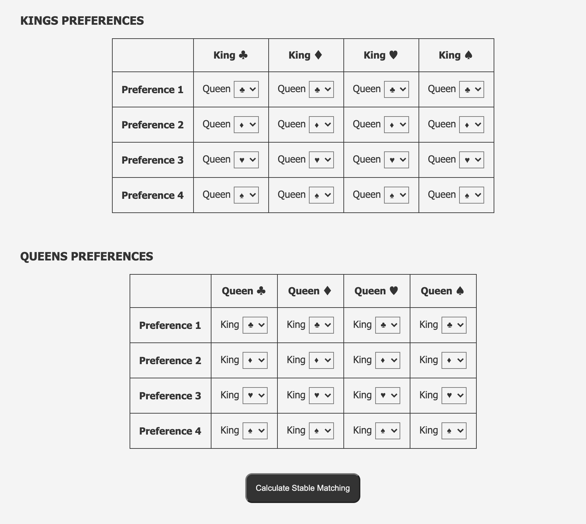
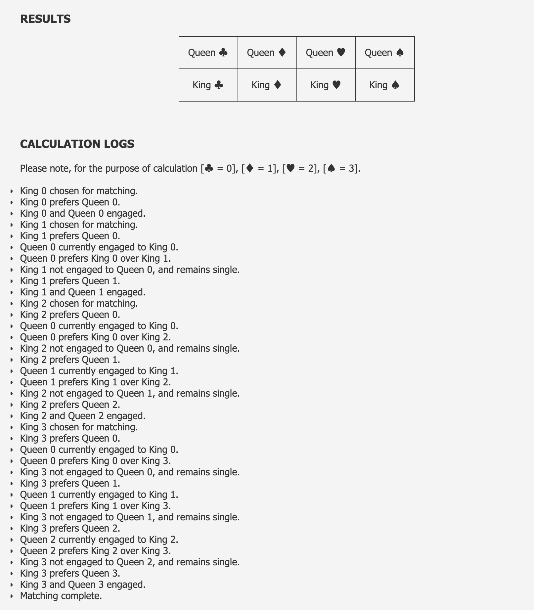

# RoyalMatch
>Implementing Nobel Prize winning Gale-Shapley algorithm with Flask &amp; Heroku \
>Reference: The Creativity Code, Marcus Du Sautoy

In mathematics, economics, and computer science, the Gale–Shapley algorithm (also known as the deferred acceptance algorithm) is an algorithm for finding a solution to the stable matching problem. The stable marriage problem (also stable matching problem or SMP) is the problem of finding a stable matching between two equally sized sets of elements given an ordering of preferences for each element. A matching is a bijection from the elements of one set to the elements of the other set. A matching is not stable if:

1. There is an element A of the first matched set which prefers some given element B of the second matched set over the element to which A is already matched, and
2. B also prefers A over the element to which B is already matched.

In other words, a matching is stable when there does not exist any match (A, B) which both prefer each other to their current partner under the matching.

<b> Applications </b>

This algorithm finds application for a variety of real world scenarios, such as:
* Match children to day-cares, in Denmark
* Allocate rabbis to synagogues, in New York
* Match students to universities, in China, Germany and Spain
* Match patients to organ donations, in UK (National Health Service)

## About 

This implementation of the Gale–Shapley algorithm aims to find stable matching for the following 4 Kings and 4 Queens given their preferences. The algorithm may be scaled to N pairs of people by simply reassigning the parameter.

### INSTRUCTIONS
* To specify preferences for each King and Queen use the given drop down menu.
* Ensure that each King or Queen has 4 unique preferences [♣, ♦, ♥, ♠], which may be listed in any order of preference.
* Please note that the algorithm will not work if the preferences for each Royal are not unique.

### RESULTS
* <b> Stable Matching: </b> The stable matching result for the given preferences is computed and displayed. There may or may not be alternate optimal solutions.
* <b> Calculation Logs: </b> The verbose calculations for the optimal result produced are also displayed for reference. 

